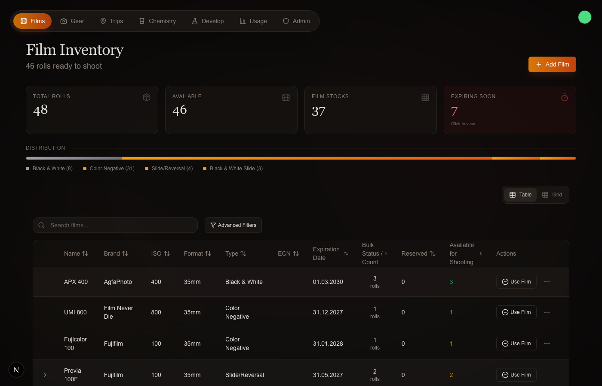
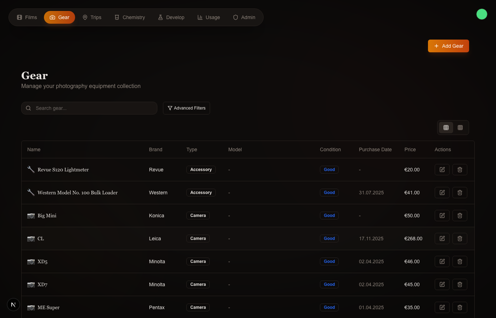
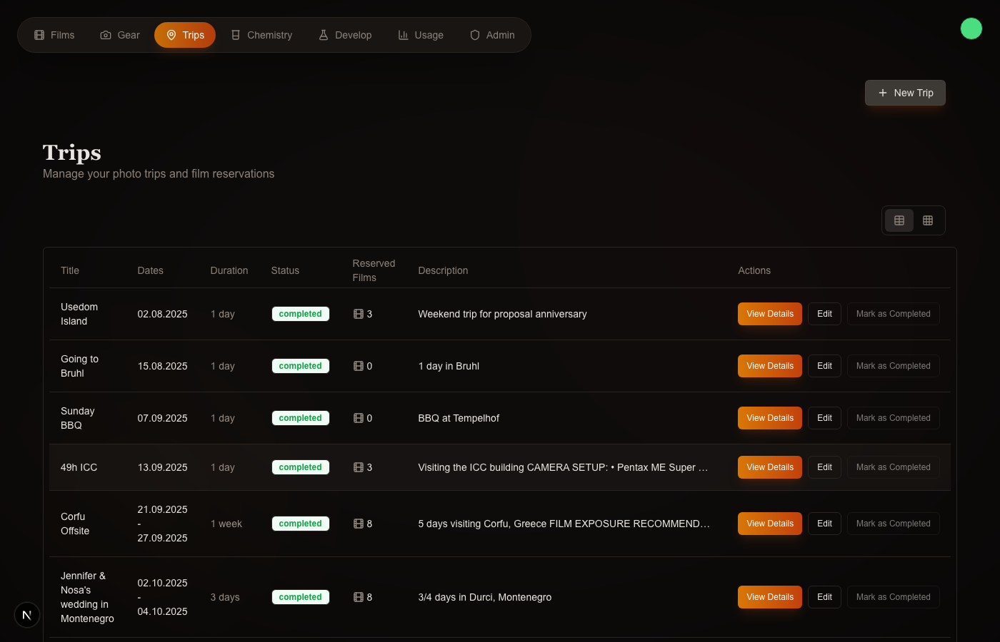
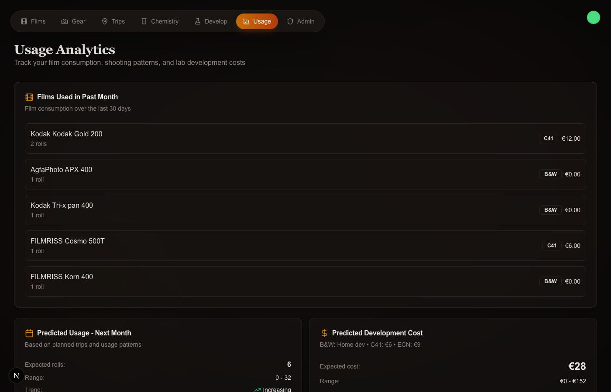

# Fuinnosho

[](https://github.com/yomete/fuinnosho/actions/workflows/ci.yml)
[](LICENSE)

A film photography inventory management system for analog photographers. Track your film stock, plan trips, and manage gear.

Built with Next.js 16, TypeScript, Supabase, and Radix UI.

The repo also includes a native SwiftUI iOS companion app in [`ios/`](ios/).
It talks directly to the same Supabase project for auth, films, gear, trips,
and shared reservation workflows.

## Screenshots

<table>
  <tr>
    <td></td>
    <td></td>
  </tr>
  <tr>
    <td><em>Film Inventory - Track your film stock with expiration dates and availability</em></td>
    <td><em>Gear Management - Catalog your cameras, lenses, and accessories</em></td>
  </tr>
  <tr>
    <td></td>
    <td></td>
  </tr>
  <tr>
    <td><em>Trip Planning - Plan photo trips and reserve film</em></td>
    <td><em>Usage Analytics - Monitor consumption patterns and costs</em></td>
  </tr>
</table>

## Features

### Film Inventory
- Track film by brand, ISO, format (35mm, 120, 4x5), and type (color negative, B&W, slide)
- Expiration date monitoring with visual timeline
- Bulk film support with automatic roll calculations
- Usage history and statistics
- Soft-delete with recovery

### Gear Management
- Catalog cameras, lenses, flashes, accessories, and more
- Track condition, serial numbers, and purchase info
- Link lenses to cameras

### Trip Planning
- Plan photo trips with date ranges and descriptions
- Reserve films for specific trips
- Pack gear for each trip
- Auto-consume reserved films when trips complete

## Tech Stack

- **Framework**: Next.js 16 (App Router)
- **Language**: TypeScript
- **Database**: Supabase (PostgreSQL + Auth)
- **UI**: Radix UI + Tailwind CSS
- **Charts**: Recharts
- **Testing**: Vitest + Playwright

## Quick Start

### Prerequisites

- Node.js 18+
- pnpm (recommended) or npm
- Supabase account

### Installation

1. Clone the repository:
   ```bash
   git clone https://github.com/yourusername/fuinnosho.git
   cd fuinnosho
   ```

2. Install dependencies:
   ```bash
   pnpm install
   ```

3. Copy the environment file:
   ```bash
   cp .env.example .env.local
   ```

4. Configure your environment variables in `.env.local`:
   ```
   NEXT_PUBLIC_SUPABASE_URL=your_supabase_url
   NEXT_PUBLIC_SUPABASE_ANON_KEY=your_supabase_anon_key
   SUPABASE_SERVICE_ROLE_KEY=your_service_role_key
   FILM_API_SECRET=your_api_secret
   ```

5. Run database migrations in your Supabase project (see `supabase/migrations/`)

6. Start the development server:
   ```bash
   pnpm dev
   ```

7. Open [http://localhost:3000](http://localhost:3000)

For detailed setup instructions, see [docs/SETUP.md](docs/SETUP.md).

## MCP Server (Claude Desktop Integration)

Fuinnosho includes an MCP server for integration with Claude Desktop. See [README-MCP.md](README-MCP.md) for setup instructions.

## iOS Companion App

The native iOS app lives in [`ios/`](ios/) and is generated with XcodeGen from
[`ios/project.yml`](ios/project.yml). See [`ios/README.md`](ios/README.md) for
setup, Supabase config, and verification commands.

```bash
MOBILE_PROBE_USER_ID=<auth-user-id> \
MOBILE_WRITE_SMOKE=1 \
MOBILE_SMOKE_CREATE_USER=1 \
pnpm verify:mobile
```

## Project Structure

```
ios/
├── Fuinnosho/        # SwiftUI app source
├── FuinnoshoTests/   # XCTest coverage
└── project.yml       # XcodeGen project definition

src/
├── app/              # Next.js App Router pages
│   ├── films/        # Film inventory
│   ├── gear/         # Gear management
│   ├── trips/        # Trip planning
│   └── settings/     # Account settings
├── components/       # React components
├── lib/              # Utilities and Supabase client
└── types/            # TypeScript types

supabase/
└── migrations/       # Database migrations
```

## Testing

```bash
# Run unit tests
pnpm test

# Run tests with coverage
pnpm test:coverage

# Run E2E tests
pnpm test:e2e
```

## Contributing

See [CONTRIBUTING.md](CONTRIBUTING.md) for guidelines on how to contribute.

## License

[AGPL-3.0](LICENSE)

---

*Fuinnosho* (封印書) - A reference to the [Scroll of Seals](https://naruto.fandom.com/wiki/Scroll_of_Seals) from Naruto. Film rolls resemble the scroll's visual design.
